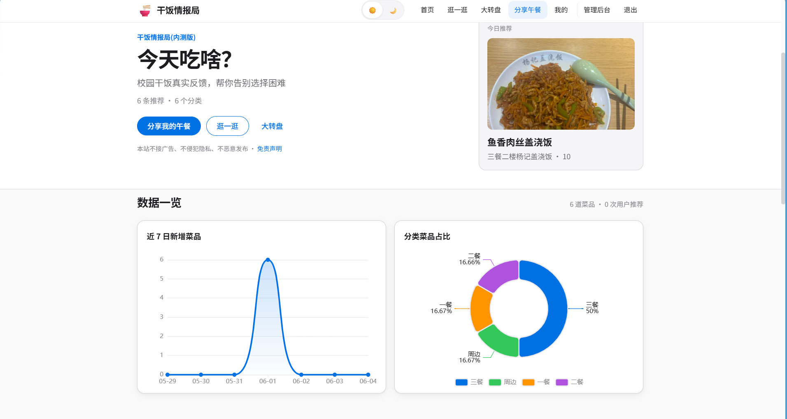
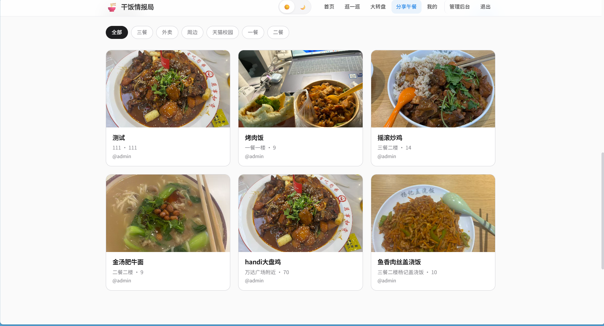
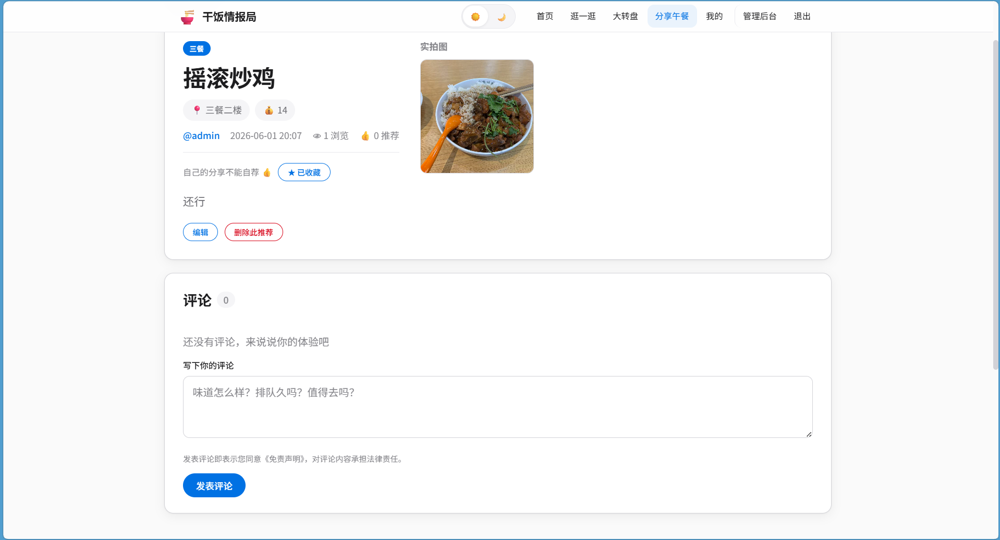

# 干饭情报局

校园干饭情报社区 —— 汇聚同学真实推荐，上传实拍、发表评论，告别选择困难。

## 截图演示

| 首页 | 详情页 | 管理后台 |
|:---:|:---:|:---:|
|  |  |  |

## 技术栈

- **后端**：Django 4.2 + MySQL（库名 `caidan`）
- **认证**：JWT（HttpOnly Cookie，前台 / 管理后台分离）
- **前端**：Django 模板 + 原生 CSS / JavaScript
- **图表**：ECharts（`dist/echarts.js`）
- **图片**：Pillow

## 项目结构

```
czb/
├── guigong_mall/      # Django 配置与根路由
├── store/             # 业务应用（模型、视图、中间件）
├── templates/         # 前台 store/、后台 admin/、公共 partials/
├── static/            # 站点 CSS / JS
├── dist/              # ECharts 构建产物
├── media/             # 用户上传图片、赞赏码
├── pay/               # 赞赏码源文件
├── manage.py
└── requirements.txt
```

## 快速启动

```powershell
cd d:\dmx\czb
.\.venv\Scripts\activate
pip install -r requirements.txt

# MySQL 建库（若未创建）：
# CREATE DATABASE caidan CHARACTER SET utf8mb4 COLLATE utf8mb4_unicode_ci;

python manage.py migrate
python manage.py seed_lunch
python manage.py createsuperuser
python manage.py runserver
```

浏览器打开 http://127.0.0.1:8000/

## 演示账号

| 角色 | 账号 | 密码 |
|------|------|------|
| 演示用户 | `demo` | `12345` |
| 管理员 | `admin` | `123456` |

## 前台功能

- **首页**：今日随缘推荐、ECharts 数据一览（近 7 日新增菜品折线 + 分类菜品占比饼图）、分类入口、最新推荐
- **逛一逛**：搜索、按分类筛选
- **详情页**：浏览、评论、回复、👍 推荐、☆ 想吃收藏、举报
- **发布 / 编辑**：多图实拍、门头照片、详细地址
- **用户主页**：点击用户名查看对方发布的情报、评论动态和数据统计（风格与用户中心统一）
- **个人中心**：资料、密码、想吃清单、账号申诉
- **大转盘**、**免责声明**、**联系管理员**、**友情链接**、**创作激励**
- **创作激励**：社区贡献排行榜、我的数据统计、支持开发者赞赏码（点击放大扫码）
- 页脚赞赏入口 + 创作激励链接
- 发帖 / 评论 / 举报频率限制（防刷）
- **移动端适配**：响应式布局、折叠导航菜单

## 管理后台

登录地址：http://127.0.0.1:8000/admin-panel/login/

- 近 7 日数据概览、热门分类 / 地址
- 推荐 / 评论 / 用户 / 分类 / 公告 / 友链 / 联系方式管理
- 举报申诉处理、编辑推荐
- 已登录管理后台的 staff 可在前台为他人情报点 👍 推荐（不能推荐自己发布的）

## 主要路由

| 页面 | 地址 |
|------|------|
| 首页 | `/` |
| 逛一逛 | `/posts/` |
| 大转盘 | `/wheel/` |
| 免责声明 | `/disclaimer/` |
| 联系管理员 | `/contact/` |
| 友情链接 | `/links/` |
| 创作激励 | `/incentive/` |
| 发布推荐 | `/post/create/` |
| 用户主页 | `/user/<id>/` |
| 想吃清单 | `/user/favorites/` |
| 管理后台 | `/admin-panel/dashboard/` |
| 举报申诉 | `/admin-panel/reports/` |
| 友链管理 | `/admin-panel/friend-links/` |

## 说明

- 生产环境请修改 `guigong_mall/settings.py` 中的数据库与 `SECRET_KEY`，并配置 `JWT_COOKIE_SECURE`。
- 静态资源收集：`python manage.py collectstatic`（`STATIC_ROOT` 为 `staticfiles/`）。
